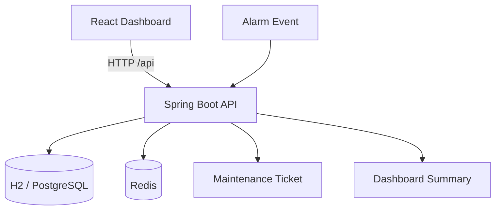

# Smart Maintenance Ticket System

React + Spring Boot 的設備異常監控與維修工單 Demo。這個專案模擬工廠設備發生異常後，系統如何完成異常上報、設備狀態異動、自動建立工單、工單處理，以及 Dashboard 統計展示的完整流程。

適合用於：
- GitHub 作品集展示
- Java 後端 / 全端面試 Demo
- 延伸成 CIM / MES / 設備整合相關題目

## Preview


## Highlights

- React Dashboard 提供設備、工單、異常事件與統計卡片的即時展示
- Spring Boot REST API 負責設備管理、異常事件、工單流程與 Dashboard Summary
- 異常上報後會自動更新設備狀態並建立維修工單
- Redis 用於 Dashboard Summary 快取、最近告警暫存與異常去重
- 支援 Docker Compose，本機可快速完成 App + Redis 啟動
- `mvn package` 會自動建置 React 前端並將靜態檔打進 jar

## Architecture



## Tech Stack

### Frontend
- React 18
- Vite
- Fetch API
- CSS Dashboard UI

### Backend
- Java 17
- Spring Boot 3.5.x
- Spring Web
- Spring Data JPA
- Spring Data Redis
- Spring Validation
- springdoc OpenAPI / Swagger UI

### Data / Infra
- H2 Database
- Redis
- Docker Compose
- Testcontainers
- Maven

## Core Features

- 設備清單查詢與狀態展示
- 異常事件上報與異常歷程查詢
- 自動建立維修工單
- 工單指派與狀態流轉
- Dashboard Summary 統計
- Redis Dashboard 快取
- 最近異常事件 Redis 快取
- 短時間異常去重，避免重複建單
- 全域例外處理與參數驗證

## Project Structure

```text
smart-maintenance-ticket-system
├── frontend/                     # React + Vite frontend
│   ├── public/
│   ├── src/
│   │   ├── api/
│   │   ├── components/
│   │   ├── lib/
│   │   ├── App.jsx
│   │   └── main.jsx
│   ├── package.json
│   └── vite.config.js
├── src/
│   ├── main/
│   │   ├── java/com/example/smartmaintenance
│   │   │   ├── controller/
│   │   │   ├── dto/
│   │   │   ├── entity/
│   │   │   ├── enums/
│   │   │   ├── exception/
│   │   │   ├── repository/
│   │   │   └── service/
│   │   └── resources/
│   └── test/
├── Docs/
├── Dockerfile
├── docker-compose.yml
├── pom.xml
└── README.md
```

## API Docs

- Swagger UI: `http://localhost:8080/swagger-ui/index.html`
- OpenAPI JSON: `http://localhost:8080/v3/api-docs`
- H2 Console: `http://localhost:8080/h2-console`

## Quick Start

### Option 1: Docker Compose

```bash
docker compose up --build
```

啟動後可直接開啟：
- App: `http://localhost:8080`
- Swagger UI: `http://localhost:8080/swagger-ui/index.html`

### Option 2: Local Development

先啟動 Redis 與 Spring Boot：

```bash
docker compose up -d redis
mvn spring-boot:run
```

再啟動 React 前端：

```bash
cd frontend
npm install
npm run dev
```

開發模式位址：
- Frontend: `http://localhost:5173`
- Backend API: `http://localhost:8080`

Vite 會自動 proxy `/api` 到 Spring Boot。

## Build

### Package Backend + Frontend Together

```bash
mvn package
```

這條命令會自動執行：
1. 安裝 Maven 所需 Node.js / npm toolchain
2. 在 `frontend/` 執行 `npm ci`
3. 在 `frontend/` 執行 `npm run build`
4. 將 React build 產物打進 Spring Boot jar

輸出檔案：
- `target/smart-maintenance-ticket-system-0.0.1-SNAPSHOT.jar`

## Test

### Full Test Suite

```bash
mvn test
```

### Frontend Build Check

```bash
cd frontend
npm run build
```

### Redis Container Integration Test Only

```bash
mvn -Dtest=AlarmRecentRedisContainerIntegrationTest test
```

## Demo Flow

1. 開啟 React Dashboard
2. 查詢設備清單，確認初始狀態為 `RUNNING`
3. 送出一筆 `POST /api/alarms` 異常事件
4. 觀察設備狀態變為 `DOWN`
5. 觀察系統自動建立維修工單
6. 指派工單處理人員
7. 更新工單狀態為 `IN_PROGRESS`、`RESOLVED`、`CLOSED`
8. 重新查看 Dashboard Summary 與異常歷程

## Redis Keys

- `dashboard:summary`
- `equipment:status:{equipmentId}`
- `alarm:recent`
- `alarm:dedup:{equipmentId}:{alarmCode}`

## Domain Rules

- 工單狀態流程：`OPEN -> IN_PROGRESS -> RESOLVED -> CLOSED`
- 設備狀態會隨工單流程更新：
  - 異常上報後：`DOWN`
  - 工單處理中：`MAINTENANCE`
  - 工單結案後：`RUNNING`
- Redis 不可用時，核心建單流程仍可回退到資料庫邏輯

## Roadmap

- PostgreSQL 正式資料庫支援
- 更多 Dashboard 圖表與篩選條件
- 設備心跳 / 離線檢測
- JWT 驗證與角色權限
- GitHub Actions CI
- Cloud Run / 雲端部署範例

## Notes

- `data.sql` 預載三筆 Demo 設備資料
- `docker compose up --build` 會同時建置 React 與 Spring Boot
- `mvn test` 目前已通過，包含 Redis Testcontainers 測試