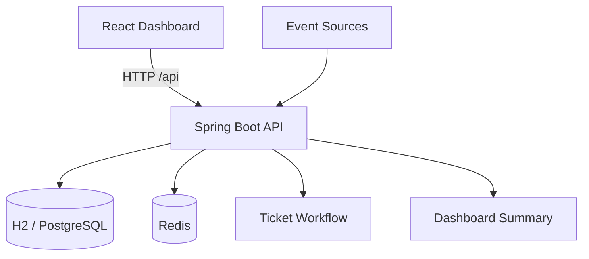

# Smart Event Ticket System

以 `Spring Boot + Redis + PostgreSQL` 設計並實作的高併發事件接收與工單派發平台，重點放在事件入口保護、資料一致性、重複請求控制、同步建單流程，以及可量化的壓測驗證；`React` Dashboard 主要作為操作與展示介面。

## Backend Highlights

- 後端核心：以 `Spring Boot REST API` 承接高頻事件流，處理事件接收、自動建單、狀態流轉、SLA 計算與 Dashboard Summary
- 流量保護設計：實作 Redis-based `Rate Limiting`、`Idempotency`、`Deduplication` 與 `Dashboard Cache`，降低 burst traffic、retry 與 duplicate event 對 DB 的衝擊
- 一致性與落地：以 `PostgreSQL` 作為 source of truth，Redis 負責保護層與快取層，清楚分離 durability 與 performance concerns
- 效能驗證：最新正式 mixed retest 達到 `1644 requests`、`109.59 req/s`、`0.00% http_req_failed`、`p95 120.84ms`、`dropped_iterations=0`
- 工程完整度：補上 `Docker Compose`、整合測試、健康檢查、Swagger 與 `GitHub Actions`，讓系統具備可部署、可驗證與可展示性

## Resume-Ready Summary

- Built a high-concurrency backend system with `Spring Boot`, `Redis`, and `PostgreSQL` for event ingestion, ticket creation, SLA tracking, and workflow transitions
- Designed Redis-based `rate limiting`, `idempotency`, and `deduplication` to protect synchronous write paths from burst traffic, retries, and duplicate business events
- Validated backend performance with k6 mixed-load testing at `109.59 req/s`, `0.00%` failure rate, `p95 120.84ms`, and `0 dropped iterations`

## Preview

### Dashboard Overview


### Event Submitted State


## Highlights

- 建立完整事件接收平台，而不是只做工單 CRUD：從 event ingestion 到 ticket lifecycle 與 dashboard 都可直接展示
- React Dashboard 提供事件上報、事件流、來源排行、工單派發與統計卡片展示，並完整支援伺服器端與前端分頁 (Pagination)
- Spring Boot REST API 提供事件接收、批次事件、模擬事件、工單流程與 Dashboard Summary
- Redis 用於事件去重、Idempotency Key、Rate Limiting 與 Dashboard 快取
- 支援 Docker Compose，本機可快速完成 App + PostgreSQL + Redis 啟動
- `mvn package` 會自動建置 React 前端並將靜態檔打進 jar

## Architecture



### Event Ingestion Sequence

~~~mermaid
sequenceDiagram
    participant Client
    participant API as Spring Boot API
    participant Redis
    participant DB as PostgreSQL

    Client->>API: POST /api/events + Idempotency-Key
    API->>Redis: Rate limit check
    API->>Redis: SET idempotency:{key} PROCESSING NX EX
    API->>Redis: Dedup key lookup
    alt New event
        API->>DB: Insert alarm event
        API->>DB: Insert maintenance ticket
        API->>Redis: Cache COMPLETED response
        API->>Redis: Evict dashboard summary cache
        API-->>Client: 201 Created
    else Duplicate business event
        API->>Redis: Cache COMPLETED duplicate response
        API-->>Client: 200 OK / duplicated=true
    else Same idempotency key replay
        API->>Redis: Return cached COMPLETED response
        API-->>Client: 200 OK / replayed result
    end
~~~

## Tech Stack

### Frontend
- React 18
- Vite
- Fetch API
- CSS Dashboard UI

### Backend
- Java 17
- Spring Boot 3.5.x
- Spring Web
- Spring Data JPA
- Spring Data Redis
- Spring Validation
- Spring Boot Actuator
- springdoc OpenAPI / Swagger UI

### Data / Infra
- H2 Database
- PostgreSQL
- Redis
- Docker Compose
- Testcontainers
- Maven
- GitHub Actions

## Core Features

- `POST /api/events` 事件接收入口
- `GET /api/events` / `GET /api/events/{id}` 事件查詢
- `POST /api/events/batch` 批次事件處理
- `POST /api/events/simulate` 模擬大量事件上報
- `GET /api/events/dedup-stats` 去重統計
- 自動建立 Ticket
- 工單指派、狀態流轉與狀態歷程
- SLA 截止時間與 breach 判定
- Dashboard Summary 統計
- Redis Dashboard 快取
- Redis Deduplication，避免重複建單
- Idempotency Key 防止重送請求重複處理
- Rate Limiting 保護單一來源高頻請求
- 全域例外處理與參數驗證

## Why It Stands Out

- 不是單純的工單 CRUD，而是把專案主軸拉成企業後端常見的高頻事件接收平台
- 用事件來源、事件類型與 business key 模擬交易異常、客服案件、監控告警等真實場景
- 前端、後端、Redis、Docker Compose 都已串起來，可直接用 Dashboard 與 Swagger Demo
- 可以從 API 設計、服務保護、狀態流轉、快取策略到 UI 展示一次講完整體設計

## High Concurrency Design

系統在 `POST /api/events` 的入口採用分層保護流程，避免大量重複事件或重送請求直接壓到資料庫：

1. `Rate Limiting`
   - 使用 Redis key `rate:{source}:{minute}` 控制單一來源短時間請求量
   - 超過門檻時直接回應，避免單一來源打爆後端
2. `Idempotency Key`
   - 使用 Redis key `idempotency:{idempotencyKey}` 記錄 `PROCESSING`、`COMPLETED`、`FAILED`
   - 相同請求重送時直接回傳第一次結果，不重複建立 Event / Ticket
3. `Deduplication`
   - 使用 Redis key `alarm:dedup:{source}:{eventType}:{businessKey}`
   - 相同來源、相同事件類型、相同業務鍵值在 dedup window 內視為重複事件，不重複建單
4. `Database as Source of Truth`
   - Redis 是保護層與快取層，正式資料仍落在關聯式資料庫
   - 讓系統同時兼顧高頻請求保護與資料一致性
5. `Dashboard Cache`
   - `dashboard:summary` 使用 Redis 快取，降低高頻查詢對 DB 的壓力

## Project Structure

```text
smart-event-ticket-system
├── .github/workflows/            # CI workflow
├── frontend/                     # React + Vite frontend
├── k6/                           # k6 load test scripts
├── src/
│   ├── main/
│   │   ├── java/com/example/smarteventticket
│   │   └── resources/
│   └── test/
├── Docs/
├── Dockerfile
├── docker-compose.yml
├── pom.xml
└── README.md
```

## API Docs

- App: `http://localhost:8080/`
- Swagger UI: `http://localhost:8080/swagger-ui/index.html`
- Actuator Health: `http://localhost:8080/actuator/health`
- OpenAPI JSON: `http://localhost:8080/v3/api-docs`
- H2 Console: `http://localhost:8080/h2-console` (`dev-h2` profile only)

## Quick Start

### Option 1: Docker Compose

```bash
docker compose up --build
```

啟動後會以 `docker-postgres` profile 啟動，資料會落到 PostgreSQL。可直接開啟：
- App: `http://localhost:8080`
- Swagger UI: `http://localhost:8080/swagger-ui/index.html`

### Option 2: Local Development

先啟動 Redis 與 Spring Boot：

```bash
docker compose up -d redis
mvn spring-boot:run
```

再啟動 React 前端：

```bash
cd frontend
npm install
npm run dev
```

開發模式位址：
- Frontend: `http://localhost:5173`
- Backend API: `http://localhost:8080`

Vite 會自動 proxy `/api` 到 Spring Boot。

## Profiles

- `dev-h2`: 預設本機 profile，使用 H2 與 `/h2-console`
- `docker-postgres`: Docker Compose profile，使用 PostgreSQL 作為持久化資料庫

## Build

### Package Backend + Frontend Together

```bash
mvn package
```

這條命令會自動執行：
1. 安裝 Maven 所需 Node.js / npm toolchain
2. 在 `frontend/` 執行 `npm ci`
3. 在 `frontend/` 執行 `npm run build`
4. 將 React build 產物打進 Spring Boot jar

輸出檔案：
- `target/smart-event-ticket-system-0.0.1-SNAPSHOT.jar`

## Test

### Full Test Suite

```bash
mvn test
```

### Frontend Build Check

```bash
cd frontend
npm run build
```

### Redis Container Integration Test Only

```bash
mvn -Dtest=AlarmRecentRedisContainerIntegrationTest test
```

### PostgreSQL + Redis Integration Test Only

```bash
mvn -Dtest=PostgresRedisIntegrationTest test
```


### k6 Load Test

~~~bash
k6 run k6/03-mixed-production-like.js
~~~

k6 測試已拆成 3 支腳本，分開觀察不同瓶頸：

- `k6/01-baseline-accepted.js`：只打 accepted path，確認同步 DB 寫入與交易延遲
- `k6/02-redis-fast-path.js`：驗證 replay、duplicate、burst rate limit 這些 Redis 快路徑
- `k6/03-mixed-production-like.js`：模擬 accepted / replay / duplicate / burst 的混合流量
- `k6/event-ingestion-test.js`：保留相容入口，等同 mixed production-like 腳本

### Route-Level Thresholds And Result Files

每支腳本都已補上：

- 全域門檻：`http_req_failed < 2%`、`http_req_duration p95 < 800ms`、`p99 < 1500ms`
- route-level thresholds：`accepted`、`duplicate`、`replay`、`burst`
- `dropped_iterations` threshold：驗證是否真的打到目標流量
- `handleSummary()` 結果落檔：每次執行都會輸出到 `k6/results/` 的 `.txt` 與 `.json`
- 自動 `RUN_ID` 前綴：正式腳本會自動替每次執行的 `businessKey` 與 `Idempotency-Key` 加上唯一前綴，避免不同回測批次互相污染

### Example Commands

~~~bash
k6 run k6/01-baseline-accepted.js
k6 run k6/02-redis-fast-path.js
k6 run k6/03-mixed-production-like.js
RUN_ID=perf-20260709 BASE_URL=http://localhost:8080 MIXED_RATE=180 DUPLICATE_RATE=120 k6 run k6/03-mixed-production-like.js
~~~

若本機未安裝 `k6` binary，可用 Docker 執行：

~~~bash
docker run --rm --network smarteventticketsystem_default -e BASE_URL=http://app:8080 -e RUN_ID=perf-20260709 -v <repo>/k6:/scripts grafana/k6 run /scripts/03-mixed-production-like.js
~~~

### Load Test Snapshot

- 最新正式 mixed retest：Dockerized k6 對 `http://app:8080` 執行縮短版混合流量，共 `1644` requests，約 `109.59 req/s`
- 最新正式 mixed retest 結果：`http_req_failed=0.00%`、`p95=120.84ms`、`dropped_iterations=0`、`scenario_checks=100.00%`
- 最新正式 mixed retest 路徑分布：`accepted=275`、`duplicate=22`、`replay=527`、`rate-limited=820`
- 在本機 Docker 與非高規格硬體環境下，這組正式 mixed 測試於約 `109.59 req/s` 的 mixed traffic 維持 `0%` 錯誤率、`p95=120.84ms`、`dropped_iterations=0`，可用來說明系統具備高併發入口保護與抗重複流量能力
- 目前已完成一輪低風險優化：accepted path 的 duplicate ticket id 快取與 dashboard summary eviction 節流；並補上 `loadtest` profile 關閉 SQL log、調整 HikariCP pool 供後續更高壓回測使用

## API Overview

### Event APIs

```http
POST /api/events
GET /api/events?page=0&size=20&sort=occurredAt,desc
GET /api/events/{id}
POST /api/events/batch
POST /api/events/simulate
GET /api/events/dedup-stats
```

### Ticket APIs

```http
GET /api/tickets?page=0&size=20&sort=createdAt,desc
GET /api/tickets/{id}
GET /api/tickets/{id}/history
PUT /api/tickets/{id}/assign
PUT /api/tickets/{id}/status
```

### Dashboard API

```http
GET /api/dashboard/summary
GET /api/dashboard/source-ranking
```

## Example Request

```http
POST /api/events
Idempotency-Key: IDEMP-20260709-0001
Content-Type: application/json
```

```json
{
  "source": "payment-system",
  "eventType": "TRANSACTION_ERROR",
  "businessKey": "TXN-10001",
  "severity": "HIGH",
  "message": "Transaction failed due to account validation error",
  "payload": "{\"transactionId\":\"TXN-10001\"}"
}
```

## Example Response

```json
{
  "success": true,
  "eventId": 1,
  "ticketId": 1,
  "duplicated": false,
  "rateLimited": false,
  "message": "Event accepted and ticket created"
}
```

## Demo Flow

1. 開啟 React Dashboard
2. 送出一筆 `POST /api/events` 事件
3. 觀察事件流新增資料
4. 觀察系統自動建立工單
5. 指派工單處理人員
6. 更新工單狀態為 `PROCESSING`、`RESOLVED`、`CLOSED`
7. 重新查看 Dashboard Summary、來源排行與去重統計
8. 重複送出相同 `source + eventType + businessKey` 觀察 duplicated 結果

## Redis Keys

- `dashboard:summary`
- `alarm:dedup:{source}:{eventType}:{businessKey}`
- `idempotency:{idempotencyKey}`
- `rate:{source}:{minute}`
- `metrics:duplicate-events`
- `metrics:rate-limited-events`
- `metrics:idempotent-replayed-events`

## System Highlights

This project demonstrates a high-frequency event ingestion and automatic ticket dispatching platform.

- Redis-based Idempotency Key with `PROCESSING`, `COMPLETED`, and `FAILED` states.
- Redis-based Deduplication Window to suppress duplicated business events.
- Per-source Rate Limiting to protect API and database from traffic bursts.
- Idempotent replay metrics surfaced in the dashboard summary.
- PostgreSQL as the source of truth in Docker deployments.
- Repository-level pagination with stable DTO responses and synchronized React UI pagination.
- Global historical source ranking API using Spring Data JPA aggregations to avoid DB dialect conflicts.
- Ticket SLA deadlines and status history for enterprise-style ticket lifecycle tracking.
- Spring Boot Actuator health endpoint, Docker healthchecks, and GitHub Actions CI.
- k6 load testing script to validate concurrent ingestion behavior.

## Domain Rules

- 工單狀態流程：`OPEN -> PROCESSING -> RESOLVED -> CLOSED`
- SLA 規則：`URGENT=1h`、`HIGH=4h`、`MEDIUM=8h`、`LOW=24h`
- 相同 `source + eventType + businessKey` 在 dedup window 內會被視為重複事件
- 相同 `Idempotency-Key` 搭配相同 request payload 會回傳第一次結果，不重複建立 Event / Ticket
- 單一來源在短時間高頻請求時會觸發 Rate Limiting
- Redis 不可用時，核心事件寫入流程仍會嘗試回退，但去重與保護能力會下降


