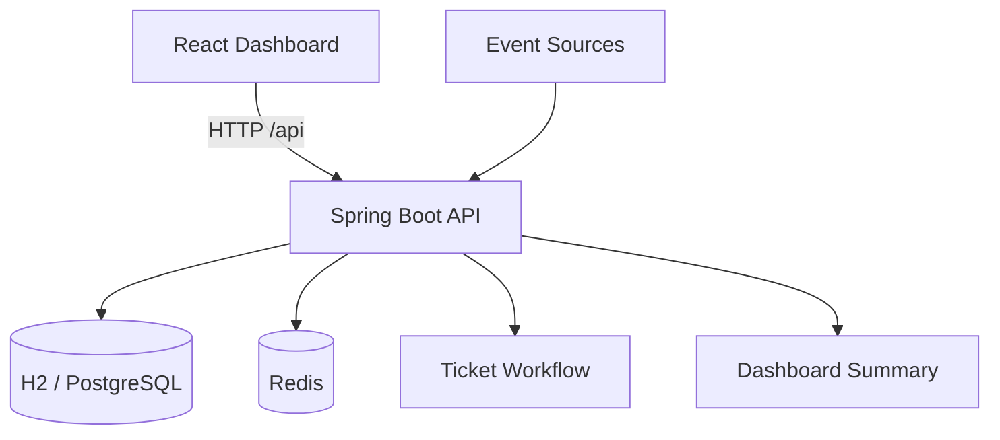

# Smart Event Ticket System

React + Spring Boot 的高併發事件接收與工單派發平台。這個專案模擬企業在短時間內接收大量系統告警、客服案件、交易異常或監控事件後，如何完成事件接收、Redis 去重、Idempotency 控制、自動建單、工單派發，以及 Dashboard 統計展示的完整流程。

## Preview

### Dashboard Overview


### Event Submitted State


## Highlights

- React Dashboard 提供事件上報、事件流、來源排行、工單派發與統計卡片展示
- Spring Boot REST API 提供事件接收、批次事件、模擬事件、工單流程與 Dashboard Summary
- Redis 用於事件去重、Idempotency Key、Rate Limiting 與 Dashboard 快取
- 支援 Docker Compose，本機可快速完成 App + Redis 啟動
- `mvn package` 會自動建置 React 前端並將靜態檔打進 jar

## Architecture



## Tech Stack

### Frontend
- React 18
- Vite
- Fetch API
- CSS Dashboard UI

### Backend
- Java 17
- Spring Boot 3.5.x
- Spring Web
- Spring Data JPA
- Spring Data Redis
- Spring Validation
- springdoc OpenAPI / Swagger UI

### Data / Infra
- H2 Database
- Redis
- Docker Compose
- Testcontainers
- Maven

## Core Features

- `POST /api/events` 事件接收入口
- `GET /api/events` / `GET /api/events/{id}` 事件查詢
- `POST /api/events/batch` 批次事件處理
- `POST /api/events/simulate` 模擬大量事件上報
- `GET /api/events/dedup-stats` 去重統計
- 自動建立 Ticket
- 工單指派與狀態流轉
- Dashboard Summary 統計
- Redis Dashboard 快取
- Redis Deduplication，避免重複建單
- Idempotency Key 防止重送請求重複處理
- Rate Limiting 保護單一來源高頻請求
- 全域例外處理與參數驗證

## Project Structure

```text
smart-maintenance-ticket-system
├── frontend/                     # React + Vite frontend
│   ├── public/
│   ├── src/
│   │   ├── api/
│   │   ├── components/
│   │   ├── lib/
│   │   ├── App.jsx
│   │   └── main.jsx
│   ├── package.json
│   └── vite.config.js
├── src/
│   ├── main/
│   │   ├── java/com/example/smartmaintenance
│   │   │   ├── controller/
│   │   │   ├── dto/
│   │   │   ├── entity/
│   │   │   ├── enums/
│   │   │   ├── exception/
│   │   │   ├── repository/
│   │   │   └── service/
│   │   └── resources/
│   └── test/
├── Docs/
├── Dockerfile
├── docker-compose.yml
├── pom.xml
└── README.md
```

## API Docs

- App: `http://localhost:8080/`
- Swagger UI: `http://localhost:8080/swagger-ui/index.html`
- OpenAPI JSON: `http://localhost:8080/v3/api-docs`
- H2 Console: `http://localhost:8080/h2-console`

## Quick Start

### Option 1: Docker Compose

```bash
docker compose up --build
```

啟動後可直接開啟：
- App: `http://localhost:8080`
- Swagger UI: `http://localhost:8080/swagger-ui/index.html`

### Option 2: Local Development

先啟動 Redis 與 Spring Boot：

```bash
docker compose up -d redis
mvn spring-boot:run
```

再啟動 React 前端：

```bash
cd frontend
npm install
npm run dev
```

開發模式位址：
- Frontend: `http://localhost:5173`
- Backend API: `http://localhost:8080`

Vite 會自動 proxy `/api` 到 Spring Boot。

## Build

### Package Backend + Frontend Together

```bash
mvn package
```

這條命令會自動執行：
1. 安裝 Maven 所需 Node.js / npm toolchain
2. 在 `frontend/` 執行 `npm ci`
3. 在 `frontend/` 執行 `npm run build`
4. 將 React build 產物打進 Spring Boot jar

輸出檔案：
- `target/smart-maintenance-ticket-system-0.0.1-SNAPSHOT.jar`

## Test

### Full Test Suite

```bash
mvn test
```

### Frontend Build Check

```bash
cd frontend
npm run build
```

### Redis Container Integration Test Only

```bash
mvn -Dtest=AlarmRecentRedisContainerIntegrationTest test
```

## API Overview

### Event APIs

```http
POST /api/events
GET /api/events
GET /api/events/{id}
POST /api/events/batch
POST /api/events/simulate
GET /api/events/dedup-stats
```

### Ticket APIs

```http
GET /api/tickets
GET /api/tickets/{id}
PUT /api/tickets/{id}/assign
PUT /api/tickets/{id}/status
```

### Dashboard API

```http
GET /api/dashboard/summary
```

## Example Request

```http
POST /api/events
Idempotency-Key: IDEMP-20260709-0001
Content-Type: application/json
```

```json
{
  "source": "payment-system",
  "eventType": "TRANSACTION_ERROR",
  "businessKey": "TXN-10001",
  "severity": "HIGH",
  "message": "Transaction failed due to account validation error",
  "payload": "{\"transactionId\":\"TXN-10001\"}"
}
```

## Example Response

```json
{
  "success": true,
  "eventId": 1,
  "ticketId": 1,
  "duplicated": false,
  "rateLimited": false,
  "message": "Event accepted and ticket created"
}
```

## Demo Flow

1. 開啟 React Dashboard
2. 送出一筆 `POST /api/events` 事件
3. 觀察事件流新增資料
4. 觀察系統自動建立工單
5. 指派工單處理人員
6. 更新工單狀態為 `PROCESSING`、`RESOLVED`、`CLOSED`
7. 重新查看 Dashboard Summary、來源排行與去重統計
8. 重複送出相同 `source + eventType + businessKey` 觀察 duplicated 結果

## Redis Keys

- `dashboard:summary`
- `alarm:dedup:{source}:{eventType}:{businessKey}`
- `idempotency:{idempotencyKey}`
- `rate:{source}:{minute}`
- `metrics:duplicate-events`
- `metrics:rate-limited-events`

## Domain Rules

- 工單狀態流程：`OPEN -> PROCESSING -> RESOLVED -> CLOSED`
- 相同 `source + eventType + businessKey` 在 dedup window 內會被視為重複事件
- 相同 `Idempotency-Key` 搭配相同 request payload 不會重複建立 Event / Ticket
- 單一來源在短時間高頻請求時會觸發 Rate Limiting
- Redis 不可用時，核心事件寫入流程仍會嘗試回退，但去重與保護能力會下降

## Current Notes

- 專案目錄與 Java package 目前仍沿用 `smartmaintenance` 命名，功能主軸已改為事件平台
- `data.sql` 仍保留舊設備示範資料，但目前 Dashboard 已不依賴設備清單
- `docker compose up --build` 會同時建置 React 與 Spring Boot
- `mvn test` 目前已通過；Redis Testcontainers 測試在沒有 Docker 環境時會自動略過

## Roadmap

- 補上 Event Source 主檔 API
- 補上 PostgreSQL 正式資料庫支援
- 加入 k6 壓測腳本與報表
- 加入 GitHub Actions CI
- 補強 Dashboard 圖表與來源篩選
- 部署到 Cloud Run / Render / Railway

