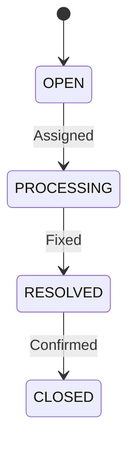

# Smart Event Ticket System 開發規格書

## 1. 專案概要

### 1.1 專案名稱

Smart Event Ticket System

### 1.2 專案目標

本專案是一個可 Demo 的前後端分離系統，後端使用 Spring Boot，前端使用 React，模擬企業在短時間內接收大量系統告警、客服案件、交易異常或監控事件後，完成事件接收、去重判斷、自動建單、工單派發與 Dashboard 統計查詢。

專案設計重點不是單純 CRUD，而是呈現「高頻事件上報 -> Rate Limiting -> Idempotency 驗證 -> Redis 去重 -> 建立 Event / Ticket -> 狀態流轉 -> 統計查詢」的完整業務流程，適合用於 GitHub 作品集、面試 Demo，以及延伸成金融業、企業後端、內部作業平台或監控事件整合相關專案。

### 1.3 適合展示的能力

- Spring Boot REST API 開發
- React 前端 Dashboard 開發
- 前後端 API 串接與資料流設計
- Spring Data JPA 資料庫操作
- Entity / DTO / Service / Repository 分層設計
- Redis 去重、快取與 TTL 設計
- Idempotency Key 與 Rate Limiting 設計
- 高頻事件接收與防重複建單流程
- 參數驗證與全域例外處理
- Swagger / OpenAPI 文件
- H2 與 PostgreSQL profile 設計
- JUnit 5 單元測試
- Docker 容器化部署
- k6 壓力測試

---

## 2. 使用情境

### 2.1 主要情境

企業內有多個事件來源持續運作，例如 `payment-system`、`core-banking`、`customer-service`、`monitoring-system`、`batch-job` 與 `api-gateway`。當系統偵測到交易異常、API timeout、客服案件、監控告警或批次失敗時，外部系統會呼叫本系統 API 上報事件。

系統收到事件後，會依序執行以下動作：

1. 檢查同一來源短時間內是否超過請求門檻。
2. 檢查 `Idempotency-Key` 是否已處理過，並比對 request hash。
3. 透過 Redis 去重，避免相同來源、相同事件類型、相同業務鍵值重複建單。
4. 儲存有效事件資料。
5. 依據事件內容與嚴重程度建立工單。
6. 處理人員可指派、處理、解決與關閉工單。
7. Dashboard API 可查詢事件、去重、限流與工單統計。

### 2.2 Demo 流程

1. 開啟 React Dashboard 與 Swagger UI。
2. 透過 Dashboard 查詢 Event Summary、Ticket Summary 與 Source Ranking。
3. 透過 Dashboard 或 Swagger 呼叫 `POST /api/events`，模擬事件來源上報異常。
4. 在 Dashboard 查看最新事件清單。
5. 在 Dashboard 查看工單清單，確認系統已自動建單。
6. 重複送出相同 `source + eventType + businessKey` 事件，展示 Redis 去重效果。
7. 使用相同 `Idempotency-Key` 重送請求，展示不會重複處理。
8. 以同一來源大量送出事件，展示 Rate Limiting 保護行為。
9. 更新工單狀態為 `PROCESSING`、`RESOLVED`、`CLOSED`。
10. 在 Dashboard 查看最新統計結果與事件分布。

---

## 3. 技術規格

### 3.1 後端技術

| 項目 | 技術 |
|---|---|
| 語言 | Java 17 |
| 框架 | Spring Boot 3.5.x |
| Web | Spring Web |
| ORM | Spring Data JPA |
| 資料庫 | H2 開發版，PostgreSQL Docker 版 |
| 快取 / 暫存 | Redis |
| API 文件 | Springdoc OpenAPI / Swagger UI |
| 驗證 | Spring Validation |
| 測試 | JUnit 5、Mockito、Spring Boot Test |
| 建置工具 | Maven |
| 部署 | Docker Compose |
| 壓測 | k6 |

### 3.2 前端技術

| 項目 | 技術 |
|---|---|
| 語言 | JavaScript |
| 框架 | React 18 |
| 建置工具 | Vite |
| HTTP Client | fetch |
| UI 展示 | Dashboard / Table / Form / Status Badge |
| 部署 | Spring Boot 靜態資源整合 |

### 3.3 Maven 主要依賴

- `spring-boot-starter-web`
- `spring-boot-starter-data-jpa`
- `spring-boot-starter-data-redis`
- `spring-boot-starter-validation`
- `com.h2database:h2`
- `org.postgresql:postgresql`
- `springdoc-openapi-starter-webmvc-ui`
- `spring-boot-starter-test`
- `testcontainers`
- `junit-jupiter`

### 3.4 Redis 應用定位

Redis 不作為主資料庫，而是作為高頻事件接收、短期狀態資料與高頻查詢優化的輔助元件，避免大量重複事件直接壓垮關聯式資料庫。

建議用途：

- 快取 Dashboard Summary，降低統計查詢對資料庫的壓力
- 記錄 Dedup Key，避免相同來源、相同事件類型、相同業務鍵值短時間重複建單
- 記錄 Idempotency Key，避免請求重送造成重複處理
- 記錄 Rate Limiting Key，限制同一來源短時間請求次數
- 暫存最近事件清單與事件摘要，方便 Demo 時快速展示

建議原則：

- PostgreSQL / H2 仍為最終資料來源
- Redis Key 需設定 TTL，避免 Key 無限累積
- 重要寫入流程以資料庫交易為主，Redis 負責去重、快取與請求保護
- 若 Redis 不可用，系統仍可退回基本事件寫入流程，但高併發保護能力會下降

### 3.5 Redis Key 設計

```text
alarm:dedup:{source}:{eventType}:{businessKey}
idempotency:{idempotencyKey}
rate:{source}:{minute}
dashboard:summary
metrics:duplicate-events
metrics:rate-limited-events
```

---

## 4. 系統模組

### 4.1 Event 接收模組

主要功能：

- 接收事件
- 驗證請求內容
- 檢查來源限流
- 檢查 Idempotency Key 與 request hash
- 執行 Redis 去重
- 儲存事件紀錄
- 自動建立工單
- 查詢事件清單

### 4.2 Ticket 工單模組

主要功能：

- 查詢工單清單
- 查詢單一工單
- 指派處理人員
- 更新工單狀態
- 記錄解決時間
- 關閉工單

### 4.3 Dashboard 統計模組

主要功能：

- 事件總數
- 有效事件數
- 重複事件數
- 被限流事件數
- 工單狀態分布
- 來源排行

### 4.4 React 前端模組

主要功能：

- 顯示 Event Summary 卡片
- 顯示 Ticket Summary 卡片
- 顯示事件清單、工單清單與來源排行
- 提供事件上報表單
- 提供工單指派與狀態更新操作
- 串接後端 API 並處理 loading / error 狀態

### 4.5 Redis 高併發保護模組

主要功能：

- Deduplication Key 管理
- Idempotency Key 狀態機管理
- Rate Limiting Key 管理
- Dashboard 統計快取
- TTL 與快取失效策略管理

### 4.6 模擬與壓測模組

主要功能：

- 批次事件模擬
- 大量重複事件模擬
- 同來源高頻請求測試
- k6 壓測腳本管理

---

## 5. 資料模型設計

### 5.1 AlarmEvent

| 欄位 | 型別 | 說明 |
|---|---|---|
| id | Long | 主鍵 |
| source | String | 事件來源 |
| eventType | EventType | 事件類型 |
| businessKey | String | 業務鍵值，例如交易編號、訂單編號 |
| severity | AlarmSeverity | 嚴重程度 |
| message | String | 事件訊息 |
| payload | String | 原始事件內容或 JSON |
| occurredAt | LocalDateTime | 發生時間 |
| createdAt | LocalDateTime | 建立時間 |

### 5.2 MaintenanceTicket

| 欄位 | 型別 | 說明 |
|---|---|---|
| id | Long | 主鍵 |
| ticketNo | String | 工單編號，例如 `EVT-20260709-AB12CD34` |
| source | String | 來源系統 |
| eventType | EventType | 事件類型 |
| businessKey | String | 關聯業務鍵值 |
| priority | TicketPriority | 優先等級 |
| status | TicketStatus | 工單狀態 |
| assignee | String | 處理人員 |
| description | String | 工單描述 |
| createdAt | LocalDateTime | 建立時間 |
| resolvedAt | LocalDateTime | 解決時間 |
| closedAt | LocalDateTime | 關閉時間 |

### 5.3 Cached Idempotency Record

| 欄位 | 型別 | 說明 |
|---|---|---|
| status | String | `PROCESSING`、`COMPLETED`、`FAILED` |
| requestHash | String | SHA-256 request hash |
| response | EventIngestionResponse | 完成時快取第一次回應 |
| errorCode | String | 失敗時記錄錯誤代碼 |

---

## 6. Enum 設計

### 6.1 EventType

| 狀態 | 說明 |
|---|---|
| TRANSACTION_ERROR | 交易異常 |
| API_TIMEOUT | API 逾時 |
| CUSTOMER_CASE | 客服案件 |
| SYSTEM_ALERT | 系統告警 |
| BATCH_FAILED | 批次失敗 |
| DUPLICATE_REQUEST | 重複請求事件 |

### 6.2 AlarmSeverity

| 狀態 | 說明 |
|---|---|
| LOW | 低風險 |
| MEDIUM | 中風險 |
| HIGH | 高風險 |
| CRITICAL | 嚴重異常 |

### 6.3 TicketPriority

| 狀態 | 說明 |
|---|---|
| LOW | 低 |
| MEDIUM | 中 |
| HIGH | 高 |
| URGENT | 緊急 |

### 6.4 TicketStatus

| 狀態 | 說明 |
|---|---|
| OPEN | 已建立 |
| PROCESSING | 處理中 |
| RESOLVED | 已解決 |
| CLOSED | 已關閉 |

---

## 7. API 規格

### 7.1 Event API

#### 上報事件

```http
POST /api/events
```

Headers:

```http
Idempotency-Key: IDEMP-20260709-0001
```

Response:

```json
{
  "success": true,
  "eventId": 101,
  "ticketId": 55,
  "duplicated": false,
  "rateLimited": false,
  "message": "Event accepted and ticket created"
}
```

#### 查詢事件清單

```http
GET /api/events?page=0&size=20&sort=occurredAt,desc
GET /api/events?source=payment-system&eventType=TRANSACTION_ERROR&severity=HIGH&page=0&size=20&sort=occurredAt,desc
```

Response shape:

```json
{
  "content": [],
  "pageable": {},
  "totalElements": 0,
  "totalPages": 0,
  "size": 20,
  "number": 0,
  "first": true,
  "last": true,
  "empty": true
}
```

#### 查詢單一事件

```http
GET /api/events/{id}
```

#### 批次事件上報

```http
POST /api/events/batch
```

#### 模擬大量事件

```http
POST /api/events/simulate
```

#### 查詢去重統計

```http
GET /api/events/dedup-stats
```

### 7.2 Ticket API

#### 查詢工單清單

```http
GET /api/tickets?page=0&size=20&sort=createdAt,desc
GET /api/tickets?status=OPEN&priority=HIGH&page=0&size=20&sort=createdAt,desc
```

#### 查詢單一工單

```http
GET /api/tickets/{id}
```

#### 指派處理人員

```http
PUT /api/tickets/{id}/assign
```

#### 更新工單狀態

```http
PUT /api/tickets/{id}/status
```

### 7.3 Dashboard API

```http
GET /api/dashboard/summary
```

---

## 8. 高併發處理流程

### 8.1 事件接收流程

```text
POST /api/events
    ↓
RateLimitService 檢查來源是否超量
    ↓
IdempotencyService 檢查 request hash 與狀態
    ↓
DeduplicationService 檢查是否為重複事件
    ↓
AlarmService 儲存事件
    ↓
TicketService 建立工單
    ↓
回傳事件處理結果
```

### 8.2 Idempotency 狀態機

```text
PROCESSING
COMPLETED:{response}
FAILED:{errorCode}
```

規則：

- 第一次請求以 Redis `SET NX EX` 取得 `PROCESSING`
- 相同 key + 相同 request hash 若已 `COMPLETED`，直接回傳第一次結果
- 相同 key + 相同 request hash 若仍 `PROCESSING`，回應衝突
- 相同 key + 不同 request hash，回應 `400 Bad Request`

### 8.3 工單狀態流程



---

## 9. 專案結構

```text
smart-event-ticket-system
├── frontend
├── k6
│   └── event-ingestion-test.js
├── Docs
├── Dockerfile
├── docker-compose.yml
├── pom.xml
├── README.md
└── src
    ├── main
    │   ├── java
    │   │   └── com.example.smarteventticket
    │   │       ├── SmartEventTicketApplication.java
    │   │       ├── config
    │   │       ├── controller
    │   │       ├── dto
    │   │       ├── entity
    │   │       ├── enums
    │   │       ├── exception
    │   │       ├── repository
    │   │       └── service
    │   └── resources
    │       ├── application.yml
    │       ├── application-dev-h2.yml
    │       ├── application-docker-postgres.yml
    │       └── data.sql
    └── test
        └── java
            └── com.example.smarteventticket
```

---

## 10. Service 設計

### 10.1 AlarmService

主要職責：

- 接收事件
- 驗證事件資料
- 驗證 Idempotency 與 request hash
- 儲存事件
- 呼叫 TicketService 建立工單
- 回傳事件處理結果

建議方法：

```java
EventProcessingResult createEvent(CreateEventRequest request, String idempotencyKey);
Page<EventResponse> findAll(String source, EventType eventType, AlarmSeverity severity, Pageable pageable);
EventResponse findById(Long id);
BatchEventResponse createBatch(BatchEventRequest request);
SimulationResultResponse simulate(SimulationRequest request);
```

### 10.2 TicketService

主要職責：

- 建立工單
- 查詢工單
- 指派處理人員
- 更新工單狀態
- 處理 resolvedAt / closedAt 時間

建議方法：

```java
MaintenanceTicket createTicketFromEvent(AlarmEvent event);
Page<TicketResponse> findAll(TicketStatus status, TicketPriority priority, Pageable pageable);
TicketResponse findById(Long id);
TicketResponse assignTicket(Long id, AssignTicketRequest request);
TicketResponse updateStatus(Long id, UpdateTicketStatusRequest request);
```

### 10.3 DeduplicationService

建議方法：

```java
boolean isDuplicate(String source, EventType eventType, String businessKey);
DedupStatsResponse getStats();
```

### 10.4 IdempotencyService

建議方法：

```java
IdempotencyStartResult startRequest(String idempotencyKey, String requestHash);
void markCompleted(String idempotencyKey, String requestHash, EventIngestionResponse response);
void markFailed(String idempotencyKey, String requestHash, String errorCode);
```

### 10.5 RateLimitService

建議方法：

```java
boolean allow(String source);
void recordRateLimitedRequest();
```

### 10.6 DashboardService

建議方法：

```java
DashboardSummaryResponse getSummary();
```

---

## 11. 例外處理設計

### 11.1 自訂例外

| Exception | 使用情境 |
|---|---|
| ResourceNotFoundException | 查無事件、工單 |
| DuplicateResourceException | Idempotency request 正在處理中 |
| InvalidStatusTransitionException | 工單狀態流程不合法 |
| InvalidIdempotencyRequestException | 相同 Idempotency Key 對應不同請求 |

### 11.2 錯誤回應格式

```json
{
  "timestamp": "2026-07-09T14:30:00",
  "status": 429,
  "error": "TOO_MANY_REQUESTS",
  "message": "Too many requests from source: payment-system",
  "path": "/api/events"
}
```

---

## 12. 驗證規則

### 12.1 CreateEventRequest

| 欄位 | 規則 |
|---|---|
| source | 必填 |
| eventType | 必填 |
| businessKey | 必填 |
| severity | 必填 |
| message | 必填，長度不可超過 500 |
| payload | 可選，長度不可超過 5000 |

### 12.2 AssignTicketRequest

| 欄位 | 規則 |
|---|---|
| assignee | 必填，長度 1 到 50 |

---

## 13. 測試規劃

### 13.1 單元測試

建議至少完成以下測試：

- 上報事件後會建立事件紀錄
- 上報事件後會自動建立工單
- Redis 去重鍵可避免短時間重複建單
- 相同 `Idempotency-Key` 重送請求不會重複處理
- 相同 `Idempotency-Key` 對不同 request body 會失敗
- 同一來源高頻請求超量時會被限流
- Dashboard 統計結果可正確命中與失效快取
- 指派工單成功
- 不合法工單狀態轉換會失敗
- 去重統計與限流統計結果正確

### 13.2 API 測試

- `POST /api/events`
- `GET /api/events`
- `GET /api/events/{id}`
- `POST /api/events/batch`
- `POST /api/events/simulate`
- `GET /api/events/dedup-stats`
- `GET /api/tickets`
- `PUT /api/tickets/{id}/assign`
- `PUT /api/tickets/{id}/status`
- `GET /api/dashboard/summary`

### 13.3 k6 壓測

建議至少完成以下壓測情境：

- 多個 VU 同時 POST `/api/events`，驗證高頻事件接收穩定性
- 短時間重複送入相同 `source + eventType + businessKey`，驗證 Redis 去重
- 同一來源短時間大量送出事件，驗證 Rate Limiting 會回傳 `429 Too Many Requests`
- 相同 `Idempotency-Key` 重複送出，驗證不會重複建立 Event / Ticket

---

## 14. Demo 與文件重點

README 建議包含：

- 專案簡介
- 系統架構圖
- 技術棧
- 功能清單
- React Dashboard 截圖
- API 文件路徑
- 啟動方式
- Demo 流程
- 測試方式
- k6 壓測說明

### 14.1 啟動指令

```bash
# backend
mvn spring-boot:run

# frontend
cd frontend
npm install
npm run dev
```

### 14.2 Swagger UI

```text
http://localhost:8080/swagger-ui/index.html
```

### 14.3 H2 Console

```text
http://localhost:8080/h2-console
```

---

## 15. 履歷描述範例

```text
建置 Java Spring Boot + React 高併發事件接收與工單派發平台，實作事件上報、自動建單、工單狀態流程、Redis 去重、Idempotency Key、Rate Limiting、Dashboard API / UI 與 k6 壓測，展示企業後端在高頻請求情境下的穩定性與工程化能力。
```

---

## 16. 最小可行版本範圍

第一版建議至少做到以下功能即可上 GitHub：

- 專案更名為 Smart Event Ticket System
- `POST /api/events`
- Redis Deduplication
- 自動建立 Ticket
- `GET /api/tickets` 與狀態更新
- React Dashboard Summary / 清單頁
- Swagger UI
- H2 Database
- README Demo 說明

若想再提高作品辨識度，可額外加入 PostgreSQL profile、完整 Idempotency 狀態機、k6 壓測與更多工程化驗證。
